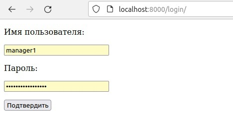
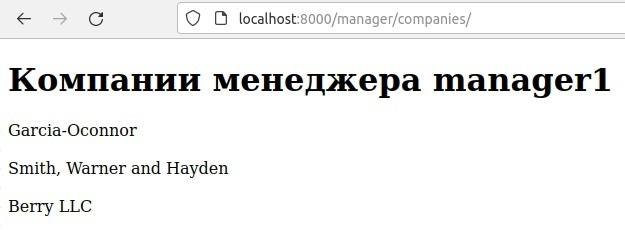
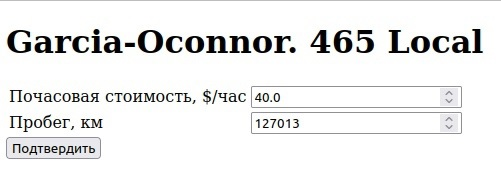
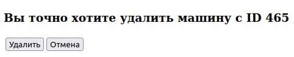
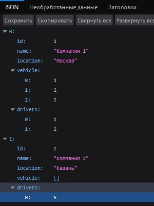
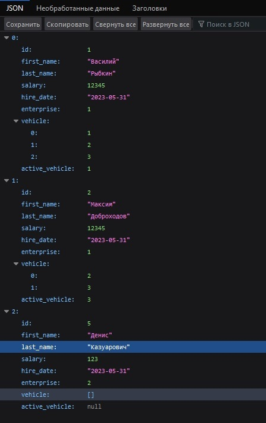
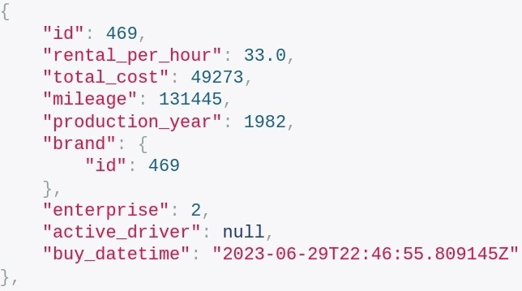
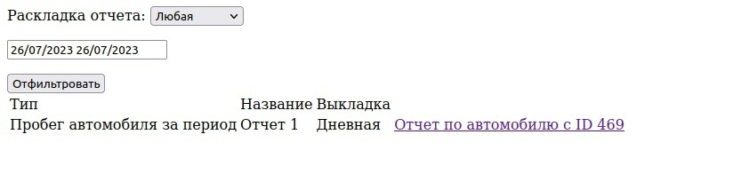
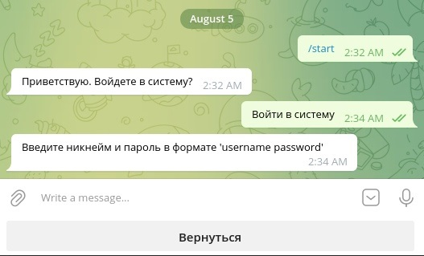
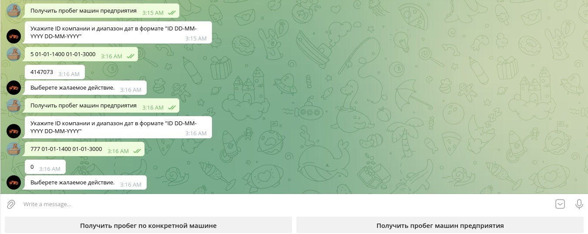

# Автопарк

Данный учебный django-проект представялет собой веб- платформу, предназначенную
для удовлетворения потребностей компании, предлагающей услуги по аренде
автомобилей.

Проект способен работать целиком внутри Docker: база данных PostgreSQL, а также
сама логика, написанная на Python.

# Использованные технологии

- Python;
- Django;
- Django REST Framework;
- PostgreSQL;
- Дополнение к PostgreSQL под название PostGIS для хранения маршрутов автомобилей;
- Yandex Static Map API
- Docker;
- Docker Compose.

# Ключевые особенности

## Аутентификация и авторизация для менеджеров компаний-клиентов

Аутентификация:

Авторизация:

## Возможность менеджеров редактирования информации об автомобилях своих компаний

Форма редактирования информации об автомобиле:

Форма удаления автомобиля:

## REST API

API для компаний:

API для водителей:

API для автомобилей:

## Дополнительные функционал и фишки

Форма запроса отчета о пробеге автомобиля:

Возможность менеджера получить маршрут автомобиля за период времени:

[Демонстрация на YouTube](https://youtu.be/iVdNZkaKX0o)

Telegram bot для получения отчетов о пробеге по конкретному автомобилю и по всем
автомобилям компании за указанный временной промежуток:

